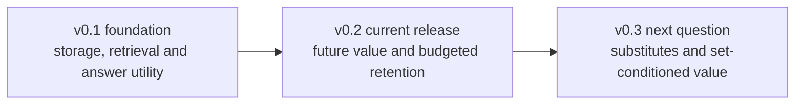

# Agent Memory Utility

English | [简体中文](README.zh-CN.md)

**From retrieval to retention: a reproducible framework for studying what long-horizon agent memory stores, retrieves, uses, and retains under budget.**

Long-running agents continuously accumulate facts, answers, and external knowledge. This project turns that growth into a sequence of testable research questions.

## Research path

v0.1 established the foundation: persistence, retrieval under growth, downstream utility, and a multimodal case study. The current v0.2 release asks whether historical signals can guide retention before future tasks are observed.

## v0.2 key findings

- **Past-only utility signals improved budgeted retention over frozen importance in the held-out benchmark.**
  Across 24 held-out synthetic trajectories, utility_aware exceeded frozen importance by 0.2014 EM averaged over three primary budgets; the descriptive trajectory-bootstrap 95% interval was [0.0972, 0.3056]. This does not establish improvement at every budget. [Formal results](releases/v0.2.0/reports/e3-formal-model/report.md)
- **True individual LOO scores did not distinguish all useful sets.** Redundant evidence can have zero deletion value for every substitute, while tied score-optimal sets have different answer scores. E4 supports this ambiguity, not the claim that every LOO-optimal set is inferior. [Set diagnostics](releases/v0.2.0/reports/e4-diagnostic-model/report.md)
- **The next question concerns substitutes and generation limits.** Exact predicted-score selection did not improve average EM here; some high-budget answers still failed with all supporting evidence read. Graphs, consolidation, and online long-term gains remain untested.

These findings concern four equally weighted synthetic stress scenarios, a fixed MiniCPM system, four memories per snapshot, and two future tasks. They do not establish natural-user or cross-model generalization.

## v0.2 artifacts

| Stage | Reproducible artifact |
|---|---|
| E1: future-value measurement | Storage deletion, window labels, historical features, and development controls |
| E2: value prediction | Past-only Ridge models, validation selection, and frozen baselines |
| E3: budgeted retention | 24 formal trajectories, 600 unique answer conditions, paired comparisons, and cost components |
| E4: set dependence | Two cohorts of 24 trajectories, 1536 enumeration conditions, and 1152 background interactions |

[Release and reproduction](docs/v0.2-release.en.md) · [Four-stage commands](experiments/utility-retention/README.md) · [Previous v0.1 foundation](docs/v0.1-four-stage-implementation-log.md)

## Reproduction and documentation

CPU verification requires no model weights. The [usage guide](docs/usage.en.md) covers installation, evidence restoration, tests, CLI commands, and UltraRAG integration. The [AMD/ROCm report](docs/environment-deployment.en.md) records the real-model setup and its validation scope.

Browse the [documentation index](docs/README.en.md) for core documentation, release details, experiment reports, and research history.

## Version closing studies

Closing studies connect each release's findings to related methods and systems through source review and scoped checks.

- [DeepNote method connection](docs/paper-notes/deepnote.en.md): the v0.1 closing study on evidence organization, with source and control-flow checks.
- [PilotDeck memory study](studies/pilotdeck-memory/README.en.md): the v0.2 closing study, following E1–E4, on capture, extraction, and organization, with an existing E4 case handoff.

These studies add no model-performance claim to frozen releases. Full-platform, representation, and matched-budget experiments remain unexecuted. [Scope and reuse](studies/README.en.md)

## Known limitations

- The memory store is local and does not isolate users or sessions.
- Retrieval has no default similarity threshold; a top-k hit does not guarantee relevance.
- Generated memories are not isolated by default, creating a possible feedback-contamination path.
- The event log is replayed in full per session and is not optimized for long-term throughput.
- Budget and utility experiments primarily use English synthetic templates and lack a new blind real-world test set.
- The multimodal study is small and uses different encoders across paths, so it cannot isolate a purely modal causal effect.
- The AMD/ROCm real-model path has not been repeated on a second clean host.

## License and upstream assets

Original code and documentation in this repository are licensed under the [Apache License 2.0](LICENSE).

This repository does not vendor the four upstream projects and does not redistribute their model weights, datasets, or paper artifacts. Those assets and third-party components remain subject to their respective licenses and terms. Apache-2.0 licensing of this repository does not grant rights to separately obtained upstream assets. See [technical lineage](docs/technical-lineage.en.md) for the recorded boundaries.

## Author and citation

Qixuan Zhong (钟启轩) — [GitHub: TOMDFTBA](https://github.com/TOMDFTBA) — [ORCID: 0009-0006-8392-1658](https://orcid.org/0009-0006-8392-1658)

Citation metadata is available in [`CITATION.cff`](CITATION.cff).

Current validation is recorded in the [v0.2 release notes](docs/v0.2-release.en.md); the [v0.1 release checklist](docs/release-checklist.md) remains historical evidence.
