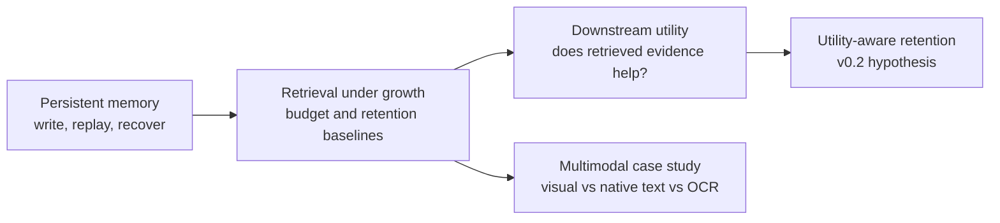

# Agent Memory Utility

English | [简体中文](README.zh-CN.md)

**From retrieval to retention: a reproducible framework for measuring what long-horizon agent memory stores, retrieves, and actually uses.**

Long-running agents continuously accumulate facts, answers, and external knowledge. This project asks how an agent can preserve and retrieve historical evidence as memory grows, whether retrieved evidence actually improves downstream answers, and which memories deserve long-term retention.

## Research path



The first three stages narrow the problem from reliable storage to retrieval and then to measured answer utility. The multimodal branch tests whether converting every source to text is always an adequate retrieval interface. Together they motivate the next question: under a fixed memory/token budget, can utility-aware retention preserve more downstream task performance than recency, importance, and semantic deduplication?

## Key findings

- **Growth is manageable, but retention policy matters.** With all memories retained, Recall@5 remained 0.949 at 10,000 memories in the balanced scenario. At a 50% retention budget, the evaluated baselines reached 0.486–0.537 Recall@5. [Results and scope](experiments/memory-budget/results/v0.1/report.en.md)
- **Retrieval success is not the same as answer success.** Full-memory retrieval at `k=3` reached 1.000 recall, yet exact match was 0.889, including 6 of 54 hit-but-wrong cases. [Utility report](experiments/memory-utility/results/v0.1/report.en.md)
- **Representation changed retrieval behavior in the small multimodal study.** The designated page ranked first for 5/5 visual queries, 4/5 native-text queries, and 3/5 OCR queries. This is an eight-page case study, not a general modality ranking. [Multimodal report](experiments/multimodal-retrieval-mini/results/v0.1/report.en.md)

## v0.1 artifacts

| Stage | Reproducible artifact |
|---|---|
| Persistent memory | JSONL → SQLite/FAISS memory store, CLI/MCP interface, UltraRAG-style pipeline, and recovery/concurrency tests |
| Memory budget | 300-run MiniCPM retrieval benchmark with recall, latency, index-size, and retention-policy results |
| Memory utility | 594 paired answers with relevant, irrelevant, conflicting, consolidated, and no-memory controls |
| Multimodal case study | Visual/native-text/OCR comparison over eight pages and five queries |

## Quick verification

Python 3.11 or 3.12 is recommended:

```bash
python3 -m venv .venv
.venv/bin/python -m pip install -e '.[mcp,test,quality]'
.venv/bin/python -m ruff check src tests scripts integrations
.venv/bin/python -m pytest -q
.venv/bin/python scripts/demo.py --mode test
```

Test mode validates storage, MCP, and orchestration with deterministic test doubles. It does not load model weights, and its vectors and `[TEST ONLY]` outputs are not semantic-quality evidence.

Ruff currently covers the reusable package, tests, scripts, and integration layer. Frozen experiment runners are validated by their recorded source hashes and are not reformatted in place after a formal run.

## Results and documentation

- [System architecture and recovery model](docs/architecture.en.md) ([中文](docs/architecture.md))
- [Stage 1 validation](docs/validation.en.md) ([中文](docs/validation.md))
- [Memory-budget report](experiments/memory-budget/results/v0.1/report.en.md) ([中文](experiments/memory-budget/results/v0.1/report.md))
- [Memory-utility report](experiments/memory-utility/results/v0.1/report.en.md) ([中文](experiments/memory-utility/results/v0.1/report.md))
- [Multimodal comparison](experiments/multimodal-retrieval-mini/results/v0.1/report.en.md) ([中文](experiments/multimodal-retrieval-mini/results/v0.1/report.md))
- [Technical lineage and upstream boundaries](docs/technical-lineage.en.md) ([中文](docs/technical-lineage.md))
- [Experiment naming and module guide](docs/experiment-development-guide.en.md) ([中文](docs/experiment-development-guide.md))

## Real models and AMD/ROCm

Copy the example configuration and point it to model directories outside this repository:

```bash
cp configs/local.example.yaml configs/local.yaml
.venv/bin/python -m pip install -e '.[models,mcp,experiments]'
.venv/bin/python scripts/demo.py --mode model
```

Real-model execution requires hardware-compatible PyTorch, MiniCPM-Embedding, and MiniCPM-2B-SFT installations. Models are loaded from local files; the runtime does not download weights automatically.

The scoped UltraRAG, MiniCPM-Embedding, VisRAG, and RAG-DDR paths were validated on Radeon 8060S, ROCm 7.14, and PyTorch 2.10. The [AMD/ROCm deployment report](docs/environment-deployment.en.md) records exact coverage, compatibility changes, and exclusions; upstream revisions are listed in the [technical lineage](docs/technical-lineage.en.md).

## Memory-store CLI

Use the test configuration when local models are unavailable:

```bash
.venv/bin/longmem --config configs/test.yaml write 'Alice prefers Vim.' --id alice-v1
.venv/bin/longmem --config configs/test.yaml write 'Alice prefers Neovim.' --id alice-v2 --supersedes alice-v1
.venv/bin/longmem --config configs/test.yaml search 'What editor does Alice prefer?' --top-k 3
.venv/bin/longmem --config configs/test.yaml get alice-v1
.venv/bin/longmem --config configs/test.yaml list --include-superseded
.venv/bin/longmem --config configs/test.yaml rebuild-index
```

Writes do not load the embedding model immediately. Vectors are generated on the first search or index rebuild. `LONGMEM_STORE_DIR` can override the configured data directory.

## UltraRAG-style integration

`integrations/ultrarag-memory/src/ultrarag-memory.py` is a standalone stdio MCP server exposing `memory_write`, `memory_search`, `memory_get`, `prompt_construction`, `generator`, and `remember_response`.

```text
memory_search → prompt_construction → generator → remember_response
```

An external UltraRAG checkout can be connected as follows:

```bash
.venv/bin/python scripts/setup.py --ultrarag /path/to/UltraRAG
export PATH="$PWD/.venv/bin:$PATH"
export LONGMEM_CONFIG="$PWD/configs/local.yaml"
ultrarag build configs/ultrarag-memory.yaml
ultrarag run configs/ultrarag-memory.yaml
```

## Reproducing the experiments

- [Memory budget](experiments/memory-budget/README.md)
- [Memory utility](experiments/memory-utility/README.md)
- [Multimodal retrieval mini](experiments/multimodal-retrieval-mini/README.md)

v0.1 completed a breaking schema consolidation and regenerated the formal results with real local models. Later experiments should use the shared configuration, I/O, and field contracts in the [experiment development guide](docs/experiment-development-guide.en.md).

The repository includes source code, frozen configurations, aggregate reports, validation summaries, and figures. It excludes model weights, vector indexes, caches, raw large-scale runs, and machine-local audit records. Stage 4 paper screenshots and OCR derivatives are also excluded until redistribution rights are confirmed.

## Known limitations

- The memory store is local and does not isolate users or sessions.
- Retrieval has no default similarity threshold; a top-k hit does not guarantee relevance.
- Generated memories are not isolated by default, creating a possible feedback-contamination path.
- The event log is replayed in full per session and is not optimized for long-term throughput.
- Budget and utility experiments primarily use English synthetic templates and lack a new blind real-world test set.
- The multimodal study is small and uses different encoders across paths, so it cannot isolate a purely modal causal effect.
- The AMD/ROCm real-model path has not been repeated on a second clean host.

## License and upstream assets

Original code and documentation in this repository are licensed under the [Apache License 2.0](LICENSE).

This repository does not vendor the four upstream projects and does not redistribute their model weights, datasets, or paper artifacts. Those assets and third-party components remain subject to their respective licenses and terms. Apache-2.0 licensing of this repository does not grant rights to separately obtained upstream assets. See [technical lineage](docs/technical-lineage.md) for the recorded boundaries.

## Author and citation

Qixuan Zhong (钟启轩) — [GitHub: TOMDFTBA](https://github.com/TOMDFTBA) — [ORCID: 0009-0006-8392-1658](https://orcid.org/0009-0006-8392-1658)

Citation metadata is available in [`CITATION.cff`](CITATION.cff).

Remaining release actions are tracked in the [v0.1 release checklist](docs/release-checklist.md).
