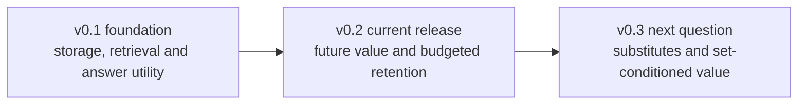

# Agent Memory Utility

English | [简体中文](README.zh-CN.md)

**From retrieval to retention: a reproducible framework for measuring what long-horizon agent memory stores, retrieves, and actually uses.**

Long-running agents continuously accumulate facts, answers, and external knowledge. This project turns that growth into a sequence of testable research questions.

## Research path

v0.1 established the foundation: persistence, retrieval under growth, downstream utility, and a multimodal case study. The current v0.2 release asks whether historical signals can guide retention before future tasks are observed.



## v0.2 key findings

- **Historical value prediction improved decisions in this benchmark.** Across 24 held-out synthetic trajectories, utility_aware exceeded frozen importance by 0.2014 EM averaged over three primary budgets; the descriptive trajectory-bootstrap 95% interval was [0.0972, 0.3056]. This does not establish improvement at every budget. [Formal results](releases/v0.2.0/reports/e3-formal-model/report.md)
- **True individual LOO scores did not distinguish all useful sets.** Redundant evidence can have zero deletion value for every substitute, while tied score-optimal sets have different answer scores. E4 supports this ambiguity, not the claim that every LOO-optimal set is inferior. [Set diagnostics](releases/v0.2.0/reports/e4-diagnostic-model/report.md)
- **The next question concerns substitutes and generation limits.** Exact predicted-score selection did not improve average EM here; some high-budget answers still failed with all supporting evidence read. Graphs, consolidation, and online long-term gains remain untested.

These findings concern four equally weighted synthetic stress scenarios, a fixed MiniCPM system, four memories per snapshot, and two future tasks. They do not establish natural-user or cross-model generalization.

## v0.2 artifacts

| Stage | Reproducible artifact |
|---|---|
| E1: future-value measurement | Storage deletion, window labels, historical features, and development controls |
| E2: value prediction | Past-only Ridge models, validation selection, and frozen baselines |
| E3: budgeted retention | 24 formal trajectories, 600 unique answer conditions, paired comparisons, and cost components |
| E4: set dependence | Two cohorts of 24 trajectories, 1536 enumeration conditions, and 1152 background interactions |

[Release and reproduction](docs/v0.2-release.en.md) · [Four-stage commands](experiments/utility-retention/README.md) · [Previous v0.1 foundation](docs/v0.1-four-stage-implementation-log.md)

## Quick verification

Python 3.11 or 3.12 is recommended:

```bash
python3 -m venv .venv
.venv/bin/python -m pip install -e '.[mcp,test,quality,experiments]'
.venv/bin/python -m ruff check src tests scripts integrations experiments/utility-retention --exclude "**/results/**"
.venv/bin/python scripts/release_artifacts.py restore-results
.venv/bin/python scripts/audit_v02.py
.venv/bin/python -m pytest -q
.venv/bin/python scripts/demo.py --mode test
```

Test mode validates storage, MCP, and orchestration with deterministic test doubles. It does not load model weights, and its vectors and `[TEST ONLY]` outputs are not semantic-quality evidence.

Ruff covers shared code, tests, scripts, integrations, and active v0.2 sources. Archived sources remain unchanged. The restore command verifies and expands local evidence without downloading models.

## Results and documentation

[Documentation index](docs/README.en.md)

- [System architecture and recovery model](docs/architecture.en.md) ([中文](docs/architecture.md))
- [Stage 1 validation](docs/validation.en.md) ([中文](docs/validation.md))
- [Memory-budget report](experiments/memory-budget/results/v0.1/report.en.md) ([中文](experiments/memory-budget/results/v0.1/report.md))
- [Memory-utility report](experiments/memory-utility/results/v0.1/report.en.md) ([中文](experiments/memory-utility/results/v0.1/report.md))
- [Multimodal comparison](experiments/multimodal-retrieval-mini/results/v0.1/report.en.md) ([中文](experiments/multimodal-retrieval-mini/results/v0.1/report.md))
- [Technical lineage and upstream boundaries](docs/technical-lineage.en.md) ([中文](docs/technical-lineage.md))
- [Experiment naming and module guide](docs/experiment-development-guide.en.md) ([中文](docs/experiment-development-guide.md))

## Version closing studies

- [DeepNote method connection](docs/paper-notes/deepnote.en.md): the v0.1 closing study on evidence organization, with source and control-flow checks.
- [PilotDeck memory study](studies/pilotdeck-memory/README.en.md): the v0.2 closing study, following E1–E4, on capture, extraction, and organization, with an existing E4 case handoff.

These studies add no model-performance claim to frozen releases. Full-platform, representation, and matched-budget experiments remain unexecuted. [Scope and reuse](studies/README.en.md)

## Real models and AMD/ROCm

Copy the example configuration and point it to model directories outside this repository:

```bash
cp configs/local.example.yaml configs/local.yaml
.venv/bin/python -m pip install -e '.[models,mcp,experiments]'
.venv/bin/python scripts/demo.py --mode model
```

Real-model execution requires hardware-compatible PyTorch, MiniCPM-Embedding, and MiniCPM-2B-SFT installations. Models are loaded from local files; the runtime does not download weights automatically.

The scoped UltraRAG, MiniCPM-Embedding, VisRAG, and RAG-DDR paths were validated on Radeon 8060S, ROCm 7.14, and PyTorch 2.10. The [AMD/ROCm deployment report](docs/environment-deployment.en.md) records exact coverage, compatibility changes, and exclusions; upstream revisions are listed in the [technical lineage](docs/technical-lineage.en.md).

## Memory-store CLI

Use the test configuration when local models are unavailable:

```bash
.venv/bin/longmem --config configs/test.yaml write 'Alice prefers Vim.' --id alice-v1
.venv/bin/longmem --config configs/test.yaml write 'Alice prefers Neovim.' --id alice-v2 --supersedes alice-v1
.venv/bin/longmem --config configs/test.yaml search 'What editor does Alice prefer?' --top-k 3
.venv/bin/longmem --config configs/test.yaml get alice-v1
.venv/bin/longmem --config configs/test.yaml list --include-superseded
.venv/bin/longmem --config configs/test.yaml rebuild-index
```

Writes do not load the embedding model immediately. Vectors are generated on the first search or index rebuild. `LONGMEM_STORE_DIR` can override the configured data directory.

## UltraRAG-style integration

`integrations/ultrarag-memory/src/ultrarag-memory.py` is a standalone stdio MCP server exposing `memory_write`, `memory_search`, `memory_get`, `prompt_construction`, `generator`, and `remember_response`.

```text
memory_search → prompt_construction → generator → remember_response
```

An external UltraRAG checkout can be connected as follows:

```bash
.venv/bin/python scripts/setup.py --ultrarag /path/to/UltraRAG
export PATH="$PWD/.venv/bin:$PATH"
export LONGMEM_CONFIG="$PWD/configs/local.yaml"
ultrarag build configs/ultrarag-memory.yaml
ultrarag run configs/ultrarag-memory.yaml
```

## Reproducing the experiments

- [Memory budget](experiments/memory-budget/README.md)
- [Memory utility](experiments/memory-utility/README.md)
- [Multimodal retrieval mini](experiments/multimodal-retrieval-mini/README.md)

v0.1 results retain their frozen formats. v0.2 reuses configuration, I/O, embedding, and generation, with an isolated list retrieval view for deletion. Cross-version baseline variants and budget units are documented in the [experiment guide](docs/experiment-development-guide.en.md).

The repository includes code, protocols, configurations, datasets, and browsable reports. Full v0.2 responses and historical sources are shipped once in a checksum-pinned archive; restore materializes the ignored results directory. v0.1 exclusions remain unchanged. Model weights, caches, and paper-page derivatives without redistribution clearance remain excluded.

## Known limitations

- The memory store is local and does not isolate users or sessions.
- Retrieval has no default similarity threshold; a top-k hit does not guarantee relevance.
- Generated memories are not isolated by default, creating a possible feedback-contamination path.
- The event log is replayed in full per session and is not optimized for long-term throughput.
- Budget and utility experiments primarily use English synthetic templates and lack a new blind real-world test set.
- The multimodal study is small and uses different encoders across paths, so it cannot isolate a purely modal causal effect.
- The AMD/ROCm real-model path has not been repeated on a second clean host.

## License and upstream assets

Original code and documentation in this repository are licensed under the [Apache License 2.0](LICENSE).

This repository does not vendor the four upstream projects and does not redistribute their model weights, datasets, or paper artifacts. Those assets and third-party components remain subject to their respective licenses and terms. Apache-2.0 licensing of this repository does not grant rights to separately obtained upstream assets. See [technical lineage](docs/technical-lineage.en.md) for the recorded boundaries.

## Author and citation

Qixuan Zhong (钟启轩) — [GitHub: TOMDFTBA](https://github.com/TOMDFTBA) — [ORCID: 0009-0006-8392-1658](https://orcid.org/0009-0006-8392-1658)

Citation metadata is available in [`CITATION.cff`](CITATION.cff).

Current validation is recorded in the [v0.2 release notes](docs/v0.2-release.en.md); the [v0.1 release checklist](docs/release-checklist.md) remains historical evidence.
