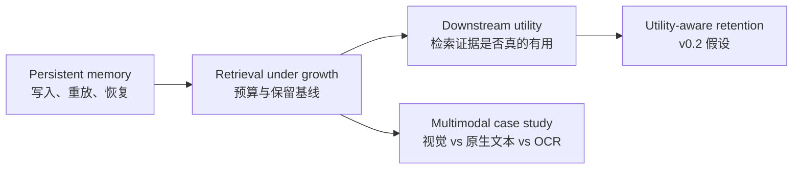

# Agent Memory Utility｜智能体记忆效用

[English](README.md) | 简体中文

从检索走向保留：一个可复现的实验框架，用于测量长期 Agent Memory 存了什么、检索到什么，以及模型真正利用了什么。

长期运行的 Agent 会持续积累事实、回答和外部知识。本项目将这种持续增长拆解为一组可以验证的研究问题。

## 研究路径

v0.1 研究四个问题：

1. 长期记忆能否被可靠地存储和恢复？
2. 随着记忆增长，检索质量和成本会如何变化？
3. 成功检索到的记忆是否真的改善了下游回答？
4. 文本是否总是可检索记忆的合适表示形式？



这些结果共同导向 v0.2：在固定 memory/token budget 下，utility-aware retention 能否比 recency、importance 和 semantic deduplication 保留更多下游任务性能？

## 关键发现

- **记忆增长并未让全量检索失效，但保留策略影响明显。** 在 balanced 场景中，全量保留在 10,000 条记忆时仍有 0.949 Recall@5；50% 保留预算下，本次基线为 0.486–0.537。[结果与边界](experiments/memory-budget/results/v0.1/report.md)
- **检索成功不等于回答成功。** 全量记忆 `k=3` 时 Recall 为 1.000，但 exact match 为 0.889，54 个样例中有 6 个 hit-but-wrong。[Memory-utility 报告](experiments/memory-utility/results/v0.1/report.md)
- **表示形式改变了这组小样本的检索行为。** 指定页排第一的次数分别为视觉 5/5、原生文本 4/5、OCR 3/5。这只是 8 页文档的案例，不是通用模态排名。[多模态报告](experiments/multimodal-retrieval-mini/results/v0.1/report.md)

## v0.1 交付物

| 阶段 | 可复现交付物 |
|---|---|
| Persistent memory | JSONL → SQLite/FAISS 记忆库、CLI/MCP、UltraRAG-style pipeline，以及恢复与并发测试 |
| Memory budget | 300 组 MiniCPM 检索实验，覆盖召回、延迟、索引大小和保留策略 |
| Memory utility | 594 个成对回答，包含 relevant、irrelevant、conflicting、consolidated 和 no-memory 对照 |
| Multimodal case study | 8 页、5 问的视觉/原生文本/OCR 对照 |

## 快速验证

推荐使用 Python 3.11 或 3.12：

```bash
python3 -m venv .venv
.venv/bin/python -m pip install -e '.[mcp,test,quality]'
.venv/bin/python -m ruff check src tests scripts integrations
.venv/bin/python -m pytest -q
.venv/bin/python scripts/demo.py --mode test
```

`test` 模式不加载模型，只验证存储、MCP 和编排链路。确定性测试向量与 `[TEST ONLY]` 输出不能用于声明真实语义质量。

Ruff 当前检查可复用 package、测试、脚本和集成层。正式运行后的冻结实验 runner 由源码 hash 验证，不在原地重新格式化。

## 结果与文档

- [系统架构与恢复机制](docs/architecture.md) ([English](docs/architecture.en.md))
- [第一阶段验收](docs/validation.md) ([English](docs/validation.en.md))
- [Memory-budget 完整报告](experiments/memory-budget/results/v0.1/report.md) ([English](experiments/memory-budget/results/v0.1/report.en.md))
- [Memory-utility 完整报告](experiments/memory-utility/results/v0.1/report.md) ([English](experiments/memory-utility/results/v0.1/report.en.md))
- [Multimodal 三路对照](experiments/multimodal-retrieval-mini/results/v0.1/report.md) ([English](experiments/multimodal-retrieval-mini/results/v0.1/report.en.md))
- [技术谱系与上游边界](docs/technical-lineage.md) ([English](docs/technical-lineage.en.md))
- [v0.1 四阶段实施日志](docs/v0.1-four-stage-implementation-log.md)
- [v0.2 四阶段实施计划](docs/v0.2-four-stage-implementation-plan.md)
- [Memory-utility 补充控制](experiments/memory-utility/controls/results/v0.1-test/report.md)
- [多模态方向判断](docs/multimodal-memory-relevance.md)
- [实验命名与模块开发指南](docs/experiment-development-guide.md) ([English](docs/experiment-development-guide.en.md))

## 真实模型与 AMD/ROCm

复制示例配置并填写仓库外的模型路径：

```bash
cp configs/local.example.yaml configs/local.yaml
.venv/bin/python -m pip install -e '.[models,mcp,experiments]'
.venv/bin/python scripts/demo.py --mode model
```

真实模型运行需要适合硬件的 PyTorch、MiniCPM-Embedding 和 MiniCPM-2B-SFT。模型加载使用本地文件模式，不会自动下载权重。

本项目已在 Radeon 8060S、ROCm 7.14 和 PyTorch 2.10 上验证限定范围的 UltraRAG、MiniCPM-Embedding、VisRAG 与 RAG-DDR 路径。完整安装范围、ROCm 兼容修改和未覆盖项见 [AMD/ROCm 环境部署与验证报告](docs/environment-deployment.md)。上游 commit 与技术用途见 [技术谱系](docs/technical-lineage.md)。

## 记忆库命令

无本地模型时使用测试配置：

```bash
.venv/bin/longmem --config configs/test.yaml write 'Alice prefers Vim.' --id alice-v1
.venv/bin/longmem --config configs/test.yaml write 'Alice prefers Neovim.' --id alice-v2 --supersedes alice-v1
.venv/bin/longmem --config configs/test.yaml search 'What editor does Alice prefer?' --top-k 3
.venv/bin/longmem --config configs/test.yaml get alice-v1
.venv/bin/longmem --config configs/test.yaml list --include-superseded
.venv/bin/longmem --config configs/test.yaml rebuild-index
```

写入时不要求立即加载模型；首次检索或重建索引时才生成向量。`LONGMEM_STORE_DIR` 可以覆盖数据目录。

## UltraRAG-style 集成

`integrations/ultrarag-memory/src/ultrarag-memory.py` 提供独立 stdio MCP 服务，暴露 `memory_write`、`memory_search`、`memory_get`、`prompt_construction`、`generator` 和 `remember_response`。

pipeline 为：

```text
memory_search → prompt_construction → generator → remember_response
```

外部 UltraRAG checkout 可以通过以下方式接入：

```bash
.venv/bin/python scripts/setup.py --ultrarag /path/to/UltraRAG
export PATH="$PWD/.venv/bin:$PATH"
export LONGMEM_CONFIG="$PWD/configs/local.yaml"
ultrarag build configs/ultrarag-memory.yaml
ultrarag run configs/ultrarag-memory.yaml
```

## 实验复现

每个实验目录包含独立协议和命令：

- [Memory budget](experiments/memory-budget/README.md)
- [Memory utility](experiments/memory-utility/README.md)
- [Multimodal retrieval mini](experiments/multimodal-retrieval-mini/README.md)

v0.1 已完成一次破坏性 schema 收敛并用真实模型重新生成正式结果；v0.2 及后续实验继续使用同一套共享配置、I/O 和字段契约，详见[实验开发指南](docs/experiment-development-guide.md)。

版本库保留代码、冻结配置、汇总报告、验证摘要和图表；模型权重、向量索引、缓存、原始大规模运行目录及本机审计记录被排除。Stage 4 的论文页面截图和 OCR 派生文件在再分发许可确认前也不纳入发布。

## 已知限制

- 当前为本地单库，没有用户/session 隔离。
- 检索没有默认相似度阈值，top-k 命中不保证相关。
- 自动回写回答标记为未验证，但 v0.1 尚未默认隔离 generated memory；这可能形成反馈污染。
- 当前事件日志按 session 全量 replay，尚未针对长期吞吐优化。
- Memory-budget 和 utility 数据以英文合成模板为主，尚无新的 blind real-world test set。
- Multimodal 实验规模很小，且不同路径使用不同 encoder，不能隔离出纯粹的 modality 因果效应。
- AMD/ROCm 真实模型路径尚未在第二台干净主机复验。

## 来源与发布状态

四个上游项目不作为源码 vendoring 到本仓库，模型权重也不进入版本控制。相关来源、版本和许可边界见 [技术谱系](docs/technical-lineage.md)。

## 作者与引用

钟启轩（Qixuan Zhong）— [GitHub：TOMDFTBA](https://github.com/TOMDFTBA) — [ORCID：0009-0006-8392-1658](https://orcid.org/0009-0006-8392-1658)

机器可读的引用信息见 [`CITATION.cff`](CITATION.cff)。

发布验证详情记录于 [v0.1 发布检查清单](docs/release-checklist.md)。本仓库自有代码和文档采用 Apache License 2.0；上游模型、数据集、论文材料及第三方代码仍分别受其自身许可证约束。
