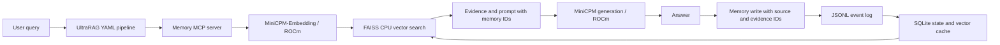

# Stage 1 Architecture and Recovery Contract

[Chinese version](architecture.md)

Stage 1 implements the agent-memory branch. An external knowledge base can later join at the prompt-construction step; the current demo does not claim that an external KB is connected.

## Data and interfaces

`Memory` contains `memory_id`, `content`, `timestamp`, `importance`, `source`, `embedding_version`, `supersedes`, and `metadata`. IDs are string primary keys in JSONL and SQLite. FAISS uses contiguous internal positions, while the `memory_ids` array in `index.json` provides an auditable one-to-one mapping rather than introducing a second business identifier.

- `write`: validates input, acquires a directory-level cross-process lock, appends and `fsync`s JSONL, then updates SQLite.
- `get`: returns a record by ID, including superseded history.
- `list`: returns active memories by default and can include history.
- `search`: searches active memories and returns complete records with cosine similarity.
- `rebuild_index`: builds FAISS from the SQLite vector cache or by re-encoding memory content.

When no ID is supplied, the store hashes a canonical JSON representation of content, source, importance, supersession, and metadata. Retrying the same logical write does not append another event. Two identical but independently occurring events should carry distinct IDs or different `metadata.session_id` values. Reusing an explicit ID with a different payload raises an error.

`supersedes` must reference an existing active record. This prevents self-references, missing references, and branched replacements. Historical records remain available, but the new record becomes active immediately; the current implementation does not infer recency from arbitrary backfilled timestamps.

## Crash and recovery behavior

| Failure state | Behavior |
|---|---|
| JSONL persisted, SQLite transaction missing | Replay the log on the next operation and restore projected state |
| Partial JSONL tail without a newline | Preserve the tail as `torn-*.bin`, truncate only the incomplete bytes, and retain all complete events |
| Corrupt complete JSONL line | Report the line number and stop; never skip silently |
| SQLite missing | Rebuild records from JSONL and regenerate vectors when needed |
| FAISS index or manifest missing/invalid | Rebuild from cached vectors or memory content |
| Embedding version changed | Build a cache and index for the new version without rewriting the original event version |
| JSONL missing while SQLite contains records | Stop and require restoration of the authoritative log |

Index files are written through a temporary file, `fsync`, and atomic replacement. The manifest records the embedding version, vector dimension, ID mapping, and index SHA-256. A crash between the two file replacements produces a validation mismatch and therefore a rebuild.

JSONL is the authoritative history; SQLite and FAISS are recoverable projections. The log must not be edited while the store is running, and the complete data directory should be backed up. A damaged SQLite file should be preserved for diagnosis and moved aside before recovery from an intact JSONL log.

## Embedding and generation

MiniCPM uses a local model and tokenizer, the upstream mean-pooling behavior, and L2 normalization. The model already applies positional weighting internally, so the wrapper does not apply it again. Queries use the `Query: ` prefix; documents do not.

The embedding-version digest includes the recorded upstream revision, configuration and model code, tokenizer content, weight-file size and modification time, truncation length, and query prefix. It is a local cache-invalidation identity, not a cryptographic verification of model weights. Published experiments should additionally pin a trusted model commit and weight checksums.

Generation uses the existing MiniCPM SFT base without loading the RAG-DDR LoRA and without training. `use_cache=False` avoids an incompatibility between the older MiniCPM code and the newer Transformers KV-cache API; it is suitable for the short demo but is not a throughput optimization.

Generated answers are written with `source=generated`, `metadata.verified=false`, and all retrieved evidence IDs. They can currently be retrieved again, so model-written content must not be treated as user-verified fact. Source filtering and utility-aware write/retention policies are left to later experiments.

## v0.1 boundaries

- Linux/Unix local filesystems only; locking relies on `fcntl.flock` and does not support Windows or distributed concurrency.
- Every operation replays the log, and the active index is rebuilt lazily after writes. This favors correctness over long-run throughput.
- SQLite can retain vectors from historical embedding versions; cache garbage collection is not implemented.
- Retrieval uses top-k similarity without a relevance threshold calibrated on labeled data.
- A single store has no user isolation or authentication; the stdio service should be launched only by a trusted local caller.
- Graph memory, automatic reflection, and multi-agent coordination are outside Stage 1.
