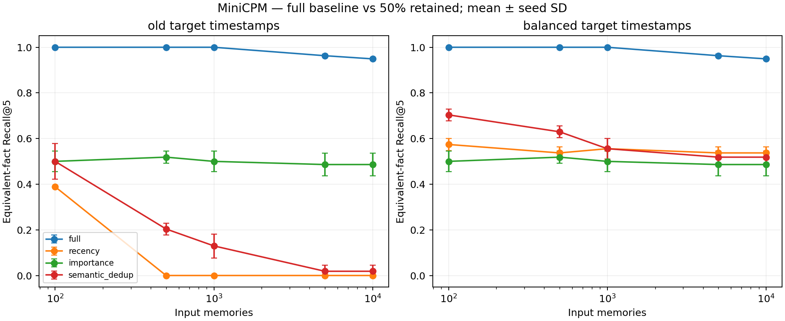
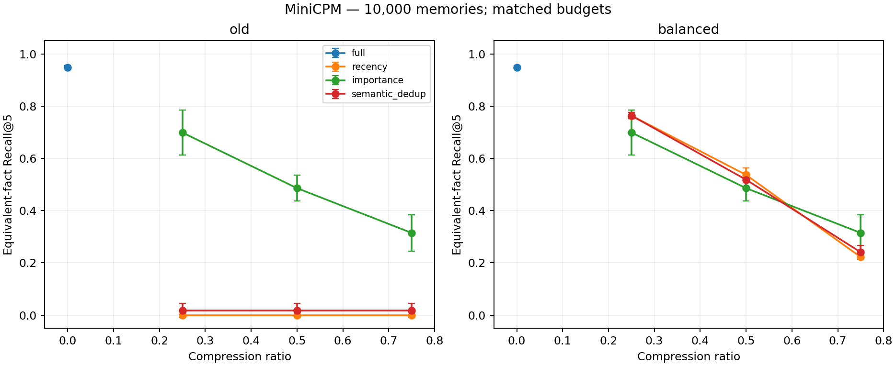
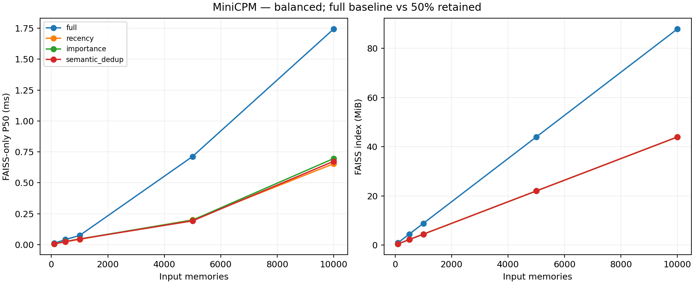

# 第二阶段记忆预算实验 v2

运行状态：COMPLETE；后端：minicpm；300 组结果。

主表：全量基线保留 100%，其他策略保留 50%。Recall 按等价事实计算；完整预算和精确 ID 指标见 summary.csv。

| 场景 | 规模 | 策略 | R@1 | R@5 ± SD | MRR | P50 ms | P95 ms | 索引 MiB | tokens |
|---|---:|---|---:|---:|---:|---:|---:|---:|---:|
| balanced | 100 | full | 0.759 | 1.000 ± 0.000 | 0.879 | 34.67 | 37.04 | 0.88 | 61.0 |
| balanced | 100 | importance | 0.375 | 0.500 ± 0.045 | 0.437 | 34.66 | 37.03 | 0.44 | 61.4 |
| balanced | 100 | recency | 0.421 | 0.574 ± 0.026 | 0.498 | 34.66 | 37.03 | 0.44 | 61.5 |
| balanced | 100 | semantic_dedup | 0.537 | 0.704 ± 0.026 | 0.620 | 34.66 | 37.03 | 0.44 | 61.2 |
| balanced | 500 | full | 0.745 | 1.000 ± 0.000 | 0.868 | 34.70 | 37.07 | 4.39 | 63.5 |
| balanced | 500 | importance | 0.380 | 0.519 ± 0.026 | 0.447 | 34.68 | 37.05 | 2.20 | 65.4 |
| balanced | 500 | recency | 0.398 | 0.537 ± 0.026 | 0.467 | 34.68 | 37.05 | 2.20 | 65.6 |
| balanced | 500 | semantic_dedup | 0.477 | 0.630 ± 0.026 | 0.552 | 34.68 | 37.05 | 2.20 | 64.8 |
| balanced | 1000 | full | 0.745 | 1.000 ± 0.000 | 0.865 | 34.73 | 37.10 | 8.79 | 63.6 |
| balanced | 1000 | importance | 0.370 | 0.500 ± 0.045 | 0.433 | 34.71 | 37.07 | 4.39 | 65.8 |
| balanced | 1000 | recency | 0.417 | 0.556 ± 0.000 | 0.485 | 34.70 | 37.07 | 4.39 | 65.6 |
| balanced | 1000 | semantic_dedup | 0.412 | 0.556 ± 0.045 | 0.483 | 34.70 | 37.07 | 4.39 | 65.0 |
| balanced | 5000 | full | 0.718 | 0.963 ± 0.007 | 0.833 | 35.37 | 37.78 | 43.95 | 64.1 |
| balanced | 5000 | importance | 0.370 | 0.486 ± 0.049 | 0.427 | 34.86 | 37.23 | 21.97 | 66.1 |
| balanced | 5000 | recency | 0.380 | 0.537 ± 0.026 | 0.447 | 34.86 | 37.22 | 21.97 | 65.9 |
| balanced | 5000 | semantic_dedup | 0.361 | 0.519 ± 0.026 | 0.429 | 34.86 | 37.23 | 21.97 | 65.4 |
| balanced | 10000 | full | 0.718 | 0.949 ± 0.007 | 0.826 | 36.42 | 38.80 | 87.89 | 64.1 |
| balanced | 10000 | importance | 0.370 | 0.486 ± 0.049 | 0.425 | 35.36 | 37.78 | 43.95 | 66.0 |
| balanced | 10000 | recency | 0.380 | 0.537 ± 0.026 | 0.447 | 35.33 | 37.72 | 43.95 | 65.9 |
| balanced | 10000 | semantic_dedup | 0.343 | 0.519 ± 0.026 | 0.419 | 35.34 | 37.76 | 43.95 | 65.4 |
| old | 100 | full | 0.759 | 1.000 ± 0.000 | 0.879 | 34.67 | 37.04 | 0.88 | 61.0 |
| old | 100 | importance | 0.375 | 0.500 ± 0.045 | 0.437 | 34.66 | 37.03 | 0.44 | 61.4 |
| old | 100 | recency | 0.366 | 0.389 ± 0.000 | 0.377 | 34.66 | 37.03 | 0.44 | 64.4 |
| old | 100 | semantic_dedup | 0.403 | 0.500 ± 0.079 | 0.451 | 34.66 | 37.03 | 0.44 | 62.7 |
| old | 500 | full | 0.745 | 1.000 ± 0.000 | 0.868 | 34.70 | 37.07 | 4.39 | 63.5 |
| old | 500 | importance | 0.380 | 0.519 ± 0.026 | 0.447 | 34.68 | 37.05 | 2.20 | 65.4 |
| old | 500 | recency | 0.000 | 0.000 ± 0.000 | 0.000 | 34.68 | 37.05 | 2.20 | 68.4 |
| old | 500 | semantic_dedup | 0.171 | 0.204 ± 0.026 | 0.188 | 34.68 | 37.05 | 2.20 | 66.0 |
| old | 1000 | full | 0.745 | 1.000 ± 0.000 | 0.865 | 34.73 | 37.10 | 8.79 | 63.6 |
| old | 1000 | importance | 0.370 | 0.500 ± 0.045 | 0.433 | 34.70 | 37.07 | 4.39 | 65.8 |
| old | 1000 | recency | 0.000 | 0.000 ± 0.000 | 0.000 | 34.70 | 37.07 | 4.39 | 68.2 |
| old | 1000 | semantic_dedup | 0.120 | 0.130 ± 0.052 | 0.125 | 34.70 | 37.07 | 4.39 | 66.2 |
| old | 5000 | full | 0.718 | 0.963 ± 0.007 | 0.833 | 35.34 | 37.71 | 43.95 | 64.1 |
| old | 5000 | importance | 0.370 | 0.486 ± 0.049 | 0.427 | 34.85 | 37.23 | 21.97 | 66.1 |
| old | 5000 | recency | 0.000 | 0.000 ± 0.000 | 0.000 | 34.88 | 37.24 | 21.97 | 68.2 |
| old | 5000 | semantic_dedup | 0.019 | 0.019 ± 0.026 | 0.019 | 34.86 | 37.26 | 21.97 | 66.7 |
| old | 10000 | full | 0.718 | 0.949 ± 0.007 | 0.826 | 36.42 | 38.81 | 87.89 | 64.1 |
| old | 10000 | importance | 0.370 | 0.486 ± 0.049 | 0.425 | 35.33 | 37.74 | 43.95 | 66.0 |
| old | 10000 | recency | 0.000 | 0.000 ± 0.000 | 0.000 | 35.33 | 37.74 | 43.95 | 68.2 |
| old | 10000 | semantic_dedup | 0.019 | 0.019 ± 0.026 | 0.019 | 35.33 | 37.73 | 43.95 | 66.7 |

延迟是查询编码与内存搜索的分项样本相加，表中为各随机种子分位数的均值；不包含加载、日志重放、持久化或 MCP。SD 为三次种子结果的总体标准差，不是置信区间。

## 解释边界

- 24 个事实主题、6 种关系；18 个测试主题 × 4 个查询改写 = 72 条查询/种子。改写不是独立事实样本，跨种子也复用主题模板。
- 固定 12 条完全重复记忆用于验证等价 ID 评分；重复比例随规模扩大而下降，不是固定重复率实验。
- 重要度是随机元数据，仅代表这一基线，不代表经过人工或效用学习的重要度。
- 语义策略先按时间贪心去重，再按预算补回被抑制项，属于“去重优先的固定预算保留”；不等同于单纯阈值去重或摘要合并。
- 时间元数据决定保留顺序，检索文本仅含 Currently/Previously，不包含绝对时间。
- 开发集仅校准去重阈值，使用单独 seed=77；主实验查询与阈值选择分离。
- 小样本、英文合成模板、本机单线程 FAISS；不能推广为真实聊天或所有硬件的结论。
- 完整接口延迟、摘要合并的事实保真、多模态和模型利用效用均不在本实验中。
